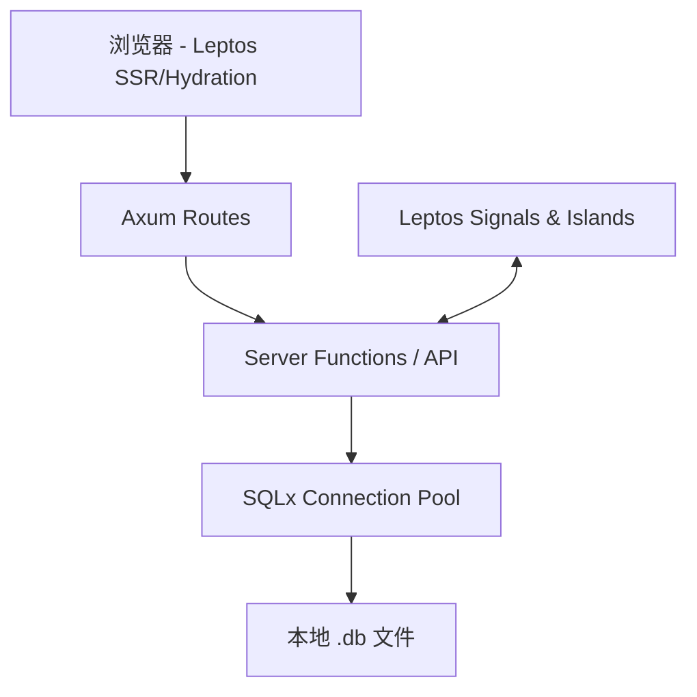

**LiteAdmin - 重构设计文档（Axum + Leptos + SQLx 技术栈）**

**版本**：2.0  
**日期**：2026年5月  
**项目名称**：LiteAdmin（全栈 Rust SQLite 管理工具）  
**技术栈**：Rust + Axum（后端） + Leptos（前端） + SQLx（SQLite） + Tailwind CSS

---

### 1. 项目概述

#### 1.1 项目目标
开发一款**纯 Rust、全栈、现代、高性能**的 SQLite 数据库管理工具，取代之前的 Tauri + Vue 方案。  
核心优势：**二进制体积更小、性能更高、无 JS 运行时、强类型端到端安全**。

**部署形态**：
- 本地运行模式（推荐）：`cargo run` 启动 Axum 服务 + Leptos SSR，在浏览器中打开 `http://localhost:3000`
- 可打包为桌面应用（可选通过 Tauri 包装 webview）
- 支持未来云部署（多用户模式）

#### 1.2 核心特性（MVP）

**MVP**：
- 本地 SQLite 文件连接管理（支持多数据库）
- 数据库对象浏览器（树形结构）
- 强大 SQL 编辑器（Monaco + 自动补全）
- 数据表格浏览、编辑、筛选、排序、虚拟滚动
- 表结构查看与修改
- 导入/导出（CSV、JSON、SQL）
- 工具命令（VACUUM、ANALYZE 等）

**后续**：
- SQLCipher 支持
- ER 图（Leptos + D3 / svg）
- AI 助手（本地 Ollama）
- 查询历史与收藏
- 暗黑模式 + 主题

---

### 2. 技术栈详细说明

| 层级         | 技术                  | 理由 |
|--------------|-----------------------|------|
| **后端**     | Axum + Tower          | 高性能、灵活中间件、异步 |
| **前端**     | Leptos (SSR + Hydration) | 细粒度响应式、Rust 全栈、无 JS |
| **数据库**   | SQLx (SQLite)         | 编译期检查、异步、高性能 |
| **样式**     | Tailwind CSS          | 原子化、与 Leptos 完美配合 |
| **编辑器**   | Monaco Editor (WASM)  | 通过 `leptos_monaco` 或直接集成 |
| **状态管理** | Leptos Signals + Server Functions | 端到端类型安全 |
| **打包**     | Cargo + Trunk / Cargo-Leptos | 单二进制部署 |

---

### 3. 系统架构



**关键设计**：
- 使用 **Leptos Server Functions** 实现端到端类型安全调用（类似 tRPC）
- Axum 提供 REST + WebSocket（实时查询进度）
- 每个数据库连接使用独立的 `Sqlx Pool`
- 文件访问通过 Axum 受控（安全路径白名单）

---

### 4. 项目目录结构

```bash
/
├── src/
│   ├── main.rs                 # Axum 启动
│   ├── app.rs                  # Leptos App 根组件
│   ├── components/             # Leptos 组件
│   ├── pages/                  # 路由页面
│   ├── server/                 # Server Functions & Axum Handlers
│   ├── models/                 # 共享数据模型
│   ├── services/               # 数据库服务
│   └── utils/
├── Cargo.toml
├── Tailwind.config.js
└── index.html
```

---

### 5. 详细 UI 组件拆分（Leptos 风格）

#### 整体布局（`App.tsx` 等价）

```markdown
┌──────────────────────────────────────────────────────────────────────────────────────┐
│  LiteAdmin                                   localhost:3000          ● 已连接      │
├──────────────────────────────────────────────────────────────────────────────────────┤
│ 文件 编辑 查看 工具 帮助      [新建查询] [刷新元数据] [VACUUM] [导出]               │
├───────────────┬──────────────────────────────────────────────────────┬───────────────┤
│ 数据库浏览器  │                   主工作区 (Tab 系统)                │  属性面板     │
│ (Sidebar)     │                                                      │               │
│               │  ┌───────┬──────────┬──────────┬──────────┐         │               │
│ ● demo.db     │  │ SQL   │ 数据浏览 │ 表结构   │  执行历史│         │  • 表: users  │
│ ├─ Tables(12) │  └───────┴──────────┴──────────┴──────────┘         │  • 行数: 1.2k │
│ │  ├ users    │                                                      │               │
│ │  ├ orders   │  当前 Tab: SQL 编辑器                                │               │
│ └─ Views(3)   │                                                      │               │
│               │  ╔══════════════════════════════════════════════════╗   │               │
│               │  ║ SELECT * FROM users WHERE age > ? LIMIT 500;    ║   │               │
│               │  ║                                                  ║   │               │
│               │  ╚══════════════════════════════════════════════════╝   │               │
│               │  [ 执行 ] [ 执行选中 ] [ 格式化 ] [ 保存 Snippet ]     │               │
│               │                                                      │               │
│               │  查询结果 (248 行)  耗时 28ms                         │               │
│               │  ┌──────┬─────────┬─────┬──────────────────────┐      │               │
│               │  │ id   │ username│ age │ email                │      │               │
│               │  └──────┴─────────┴─────┴──────────────────────┘      │               │
├───────────────┴──────────────────────────────────────────────────────┴───────────────┤
│  1248 行 | SQLite 3.46 | demo.db (4.8MB) | Rust + Leptos + Axum               │
└──────────────────────────────────────────────────────────────────────────────────────┘
```

---

### 6. 主要 Leptos 组件拆分

**布局组件**：
- `<AppLayout>`：根布局 + 响应式 Split 面板
- `<HeaderBar>`：顶部菜单 + 工具栏
- `<DatabaseSidebar>`：树形浏览器（`leptos-use` + 递归组件）
- `<MainTabs>`：可拖拽标签页系统
- `<StatusBar>`：底部状态

**核心功能组件**：
- `<SqlEditor>`：Monaco Editor 集成 + 实时补全（Server Function 动态提供 schema）
- `<DataTable>`：Leptos + TanStack Table 风格虚拟表格（支持编辑）
- `<TableStructure>`：字段/索引/外键管理
- `<QueryResult>`：表格 / JSON / 图表视图切换
- `<ConnectionManager>`：多数据库切换

**弹窗组件**（使用 `<Dialog>` + Portal）：
- New Connection / Open Database
- Create Table / Alter Table
- Import / Export Wizard
- Settings

---

### 7. 原型 - SQL 编辑器页面（详细）

```markdown
SQL 查询 - users.sql

[────────────────────────────── 编辑器区域 ──────────────────────────────]
SELECT * FROM users 
WHERE status = 'active' 
ORDER BY created_at DESC 
LIMIT 1000;

[ 执行全部 ] [ 执行选中 ] [ 解释计划 ] [ 格式化 ] [ 保存 ]

────────────────────────────────────────────────────────────────────────────
查询结果 - 248 行 (共 1248)               耗时: 31ms   成功 ✓

┌───────┬────────────┬─────┬───────────────────────────┐
│ id    │ username   │ age │ email                     │
├───────┼────────────┼─────┼───────────────────────────┤
│ 42    │ 张三       │ 28  │ zhang@example.com         │
│ 43    │ 李四       │ 35  │ li@demo.com               │
└───────┴────────────┴─────┴───────────────────────────┘

分页: [<<] [ < ]  1 / 13  [ > ] [ >> ]   每页 100 条
```

---

### 8. 开发计划（建议）

**阶段 1（MVP - 4~5 周）**：
- Axum + Leptos 项目初始化 + SQLx 连接
- 数据库连接管理 + 元数据读取
- 基础 SQL 执行 + 结果展示

**阶段 2（5~6 周）**：
- Monaco 编辑器集成 + 智能补全
- 数据表格 + 编辑功能
- 导入导出

**阶段 3**：
- 高级 UI + ER 图 + AI

---

**优势对比（相对 Tauri + Vue）**：
- 端到端类型安全（无 JSON 序列化隐患）
- 更小的最终体积
- 更好的性能（尤其是大数据渲染）
- 更易维护（全 Rust）

---

**下一步**：

我可以立即为您提供以下**生产级代码框架**：

1. `Cargo.toml` + 项目初始化配置
2. Axum + Leptos 主路由与 Server Functions 模板
3. Leptos 主布局组件（`AppLayout`）
4. SQLx 服务层代码
5. 数据库树组件完整实现

请告诉我您希望优先获得哪一部分的**详细代码**，我将直接输出。